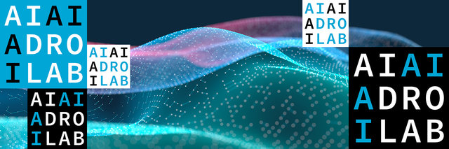

<div style="display: flex; justify-content: center; align-items: center; margin-top: 10px; margin-bottom: 10px;">
    
    
</div>


**Welcome!** \
This seminar series brings together researchers from TU Delft working on Graphs and Data. 

The seminar takes place every month and comprises 2/3 talks:
- One long talk + Q&A (45min)
- One/two shorter talks + Q&A (targeting a specific topic/research) (20 min).

[ [**Register here**](https://forms.office.com/pages/responsepage.aspx?id=TVJuCSlpMECM04q0LeCIewbAA7RP87dNtvNVETSiRPZUODZGSzBRM1FTM09JWjlLTlVTVTgzRjFKUi4u) ] to attend the next seminar and receive email updates about the seminar.

---

# **Upcoming Talks**


## [February 13th, 2025] **Networks, Machine Learning and Crime Analysis**

**Location**: Building 28: Turing room 0.E420

**Time**: 10:30 - 12:00

- [**Graph ML for Financial Crime Analysis**](./past_talks/20250213#graph-ml-for-financial-crime-analysis), [Kubilay Atasu](https://atasu-kubilay.github.io/)

- [**Multigraph Neural Networks for Financial Transaction Graphs**](./past_talks/20250213#multigraph-neural-networks-for-financial-transaction-graphs), [Çağrı Bilgi](https://hcagri.github.io/)

- [**Higher-order temporal network prediction and interpretation**](./past_talks/20250213#higher-order-temporal-network-prediction-and-interpretation), [Bart Peters](https://www.tudelft.nl/ewi/over-de-faculteit/afdelingen/intelligent-systems/multimedia-computing/people/bart-peters)


---


# **Past Talks**


## [January 9th, 2025] **Network Controllability**


- [**Controllability of Networks Under Sparsity Constraints**](./past_talks/20250109.md#controllability-of-networks-under-sparsity-constraints), [Geethu Joseph](https://microelectronics.tudelft.nl/People/bio.php?id=794) \
    [ [<span style="color:#D22B2B">Slides</span>
    ](../slides/20250109_joseph.pdf) ] [ [<span style="color:green">Recording</span>
    ](https://www.youtube.com/watch?v=5vtfks3K0d4&ab_channel=Elvinisufi) ]


- [**On the Optimality of Sparse Feedback Control Under Architecture-Dependent Communication Delays**](./past_talks/20250109.md#on-the-optimality-of-sparse-feedback-control-under-architecture-dependent-communication-delays), [Luca Ballotta](https://scholar.google.com/citations?user=0Fv9vH8AAAAJ&hl=it) \
    [ [<span style="color:#D22B2B">Slides</span>
    ](../slides/20250109_ballotta.pdf) ] [ [<span style="color:green">Recording</span>
    ](https://www.youtube.com/watch?v=LOjETTJIG-I&ab_channel=Elvinisufi) ]


## [December 5th, 2024] **Network Science**


- [**Approximations for Kemeny's Constant for Several Families of Graphs and Real-World Networks**](./past_talks/20241205#approximations-for-kemenys-constant-for-several-families-of-graphs-and-real-world-networks), [Rob Kooij](https://www.nas.ewi.tudelft.nl/index.php/rob-kooij) \
    [ [<span style="color:#D22B2B">Slides</span>
    ](../slides/20241205_kooij.pdf) ] [ [<span style="color:green">Recording</span>
    ](https://www.youtube.com/watch?v=TxWf30M_7fw&ab_channel=Elvinisufi) ]


- [**Network Reliability: Approximation, Upper Bounds, and Applications to Network Robustness**](./past_talks/20241205#network-reliability-approximation-upper-bounds-and-applications-to-network-robustness), [Xinhan Liu](https://www.nas.ewi.tudelft.nl/index.php/xinhan-liu) \
    [ [<span style="color:#D22B2B">Slides</span>
    ](../slides/20241205_liu.pdf) ] [ [<span style="color:green">Recording</span>
    ](https://www.youtube.com/watch?v=HPDzjUdmno0&ab_channel=Elvinisufi) ]


- [**Diffusion Backbones of Temporal Higher-Order Networks**](./past_talks/20241205#diffusion-backbones-of-temporal-higher-order-networks), [Shilun Zhang](https://www.tudelft.nl/en/ewi/over-de-faculteit/afdelingen/intelligent-systems/multimedia-computing/people/shilun-zhang) \
    [ [<span style="color:#D22B2B">Slides</span>
    ](../slides/20241205_zhang.pdf) ] [ [<span style="color:green">Recording</span>
    ](https://www.youtube.com/watch?v=mxxVS_vvyTI&ab_channel=Elvinisufi) ]


## [November 7th, 2024] **Graph Neural Networks for Power Systems**


- [**Opportunities & Challenges in Graph-Based Learning for Power System Application**](./past_talks/20241107#opportunities--challenges-in-graph-based-learning-for-power-system-application), [Jochen Cremer](https://www.tudelft.nl/en/staff/j.l.cremer/) \
    [ [<span style="color:#D22B2B">Slides</span>
    ](../slides/20241107_cremer.pdf) ] [ [<span style="color:green">Recording</span>
    ](https://www.youtube.com/watch?v=vBZSimvXY1A&ab_channel=Elvinisufi) ]
- [**Graph Shift Operator for Power System Applications**](./past_talks/20241107#graph-shift-operator-for-power-system-applications), [Ola Arowolo](https://www.tudelft.nl/en/staff/o.a.arowolo/?cHash=48dcf707ee57e8f585ddb4a8d2ee78b1) \
    [ [<span style="color:#D22B2B">Slides</span>
    ](../slides/20241107_arowolo.pdf) ] [ [<span style="color:green">Recording</span>
    ](https://www.youtube.com/watch?v=34RRkYme-Jk&ab_channel=Elvinisufii) ]
- [**Enabling Large-Scale Coordination of Electric Vehicles Using Reinforcement Learning**](./past_talks/20241107#enabling-large-scale-coordination-of-electric-vehicles-using-reinforcement-learning), [Stavros Orfanoudakis](https://www.tudelft.nl/staff/s.orfanoudakis/?cHash=253c79932834cee4e47e4fc0adb061bd) \
    [ [<span style="color:#D22B2B">Slides</span>
    ](../slides/20241107_orfanoudakis.pdf) ] [ [<span style="color:green">Recording</span>
    ](https://www.youtube.com/watch?v=7OGP2XiIsAs&ab_channel=Elvinisufi) ]


## [October 3rd, 2024] **Graph Generation for Chemical Engineering**
- [**Generative Artificial Intelligence for Chemical Process Engineering**](./past_talks/20241003.md#generative-artificial-intelligence-for-chemical-process-engineering), [Artur M. Schweidtmann](https://www.tudelft.nl/en/faculty-of-applied-sciences/about-faculty/departments/chemical-engineering/principal-investigators/artur-schweidtmann)
- [**Generative Artificial Intelligence for Control Structure Prediction**](./past_talks/20241003.md#generative-artificial-intelligence-for-control-structure-prediction), [Lukas Schulze Balhorn](https://www.tudelft.nl/en/staff/l.schulzebalhorn/) \
    [ [<span style="color:#D22B2B">Slides</span>
    ](../slides/20241003_balhorn.pdf) ]
- [**Process Design through Deep Reinforcement Learning and Graph Neural Networks**](./past_talks/20241003.md#process-design-through-deep-reinforcement-learning-and-graph-neural-networks), [Qinghe Gao](https://www.tudelft.nl/en/faculty-of-applied-sciences/about-faculty/departments/chemical-engineering/about-the-department/process-systems-engineering/people/qinghe-gao) \
    [ [<span style="color:#D22B2B">Slides</span>
    ](../slides/20241003_gao.pdf) ]


## [July 11th, 2024] **Special session - Learning with Graphs** 
- [**Online Learning of Nonlinear and Dynamic Graphs**](./past_talks/20240711.md#online-learning-of-nonlinear-and-dynamic-graphs), [Rohan Thekkemarickal Money](https://scholar.google.com/citations?user=JnkbP8EAAAAJ&hl=en)  \
    [ [<span style="color:#D22B2B">Slides</span>
    ](../slides/20240711_money.pdf) ] [ [<span style="color:green">Recording</span>
    ](https://www.youtube.com/watch?v=3QFQ1rdJhH4&ab_channel=Elvinisufi) ]

- [**Mixup for Augmenting Data in Myriad Scenarios**](./past_talks/20240711.md#mixup-for-augmenting-data-in-myriad-scenarios), [Madeline Navarro](https://scholar.google.com/citations?user=LJxDdfMAAAAJ&hl=en)  \
    [ [<span style="color:#D22B2B">Slides</span>
    ](../slides/20240711_navarro.pdf) ] [ [<span style="color:green">Recording</span>
    ](https://www.youtube.com/watch?v=YtEAyeUZk9g&ab_channel=Elvinisufi) ]

- [**Exploiting the Structure of Two Graphs with Graph Neural Networks**](./past_talks/20240711.md#exploiting-the-structure-of-two-graphs-with-graph-neural-networks), [Víctor Manuel Tenorio Gómez](https://gestion2.urjc.es/pdi/ver/victor.tenorio)  \
    [ [<span style="color:#D22B2B">Slides</span>
    ](../slides/20240711_tenorio.pdf) ] [ [<span style="color:green">Recording</span>
    ](https://www.youtube.com/watch?v=KXfvu2maXEM&ab_channel=Elvinisufi) ]

## [May 2nd, 2024] **System Identification**
- [**Identification of Networks of Dynamic Systems**](./past_talks/20240502.md), [Michel Verhaegen](https://www.dcsc.tudelft.nl/~mverhaegen/) \
    [ [<span style="color:#D22B2B">Slides</span>
    ](../slides/20240502_verhaegen.pdf) ] [ [<span style="color:green">Recording</span>
    ](https://www.youtube.com/watch?v=kyIR-46D5l4&list=PLdzxeAZte_YvxvSCBiQyDdyO8muNHWnLr&index=26) ]

## [April 4th, 2024] **PDEs and Graphs**
- [**Graphs and Differential Equations in Machine Learning**](./past_talks/20240404.md#graphs-and-differential-equations-in-machine-learning), [Yves van Gennip](https://scholar.google.com/citations?user=ZV9trHAAAAAJ&hl=en)
- [**Inferring Time-Varying Signals over Graphs via SPDEs**](./past_talks/20240404.md#inferring-time-varying-signals-over-graphs-via-spdes), [Mohammad Sabbaqi](https://scholar.google.com/citations?user=5lnSQvEAAAAJ&hl=en) \
    [ [<span style="color:#D22B2B">Slides</span>
    ](../slides/20240404_sabbaqi.pdf) ] [ [<span style="color:green">Recording</span>
    ](https://www.youtube.com/watch?v=gsTkltliHbY&ab_channel=Elvinisufi) ]


## [March 14th, 2024] **Higher-Order Structures**
- [**Geometry Processing: Discretization, Learning and Analysis**](./past_talks/20240314.md#geometry-processing-discretization-learning-and-analysis), [Klaus Hildebrandt](https://graphics.tudelft.nl/~klaus/)
- [**Hodge-compositional Edge Gaussian Processes**](./past_talks/20240314.md#hodge-compositional-edge-gaussian-processes), [Maosheng Yang](https://scholar.google.dk/citations?user=-ka_yNQAAAAJ&hl=en) \
    [ [<span style="color:#D22B2B">Slides</span>
    ](../slides/20240314_yang.pdf) ] [ [<span style="color:green">Recording</span>
    ](https://www.youtube.com/watch?v=qzuViV-Qk88&ab_channel=Elvinisufi) ]

- [**DeltaConv: Anisotropic Operators for Geometric Deep Learning on Point Clouds**](./past_talks/20240314.md#deltaconv-anisotropic-operators-for-geometric-deep-learning-on-point-clouds), [Ruben Wiersma](https://rubenwiersma.nl/) \
    [ [<span style="color:#D22B2B">Slides</span>
    ](../slides/20240314_wiersma.pdf) ] [ [<span style="color:green">Recording</span>
    ](https://www.youtube.com/watch?v=r8uGsmRQO8M&list=PLdzxeAZte_YvxvSCBiQyDdyO8muNHWnLr&index=8&ab_channel=Elvinisufi) ]

## [February 15th, 2024] **Water Networks**
- [**Towards Foundational (Meta)models of Water Distribution Networks with Graph Neural Networks**](./past_talks/20240215.md#towards-foundational-metamodels-of-water-distribution-networks-with-graph-neural-networks), [Riccardo Taormina](https://www.tudelft.nl/citg/over-faculteit/afdelingen/watermanagement/medewerker/staff-sanitary-engineering/dr-riccardo-taormina) \
    [ [<span style="color:#D22B2B">Slides</span>
    ](../slides/20240215_taormina.pdf) ] [ [<span style="color:green">Recording</span>
    ](https://www.youtube.com/watch?v=fMsdNcRtbU8&ab_channel=Elvinisufi) ]

- [**Faster and Transferable Urban Drainage Simulations with Graph Neural Networks**](./past_talks/20240215.md#faster-and-transferable-urban-drainage-simulations-with-graph-neural-networks), [Alexander Garzón](https://www.tudelft.nl/en/staff/j.a.garzondiaz/?cHash=179501011185fb0c281345f9391fef44) \
    [ [<span style="color:#D22B2B">Slides</span>
    ](../slides/20240215_garzon.pdf) ] [ [<span style="color:green">Recording</span>
    ](https://www.youtube.com/watch?v=O-eDIP2Ka9Q&ab_channel=Elvinisufi) ]

- [**Relating Complex Network Theory Metrics with Discolouration Activity in Water Distribution Systems**](./past_talks/20240215.md#relating-complex-network-theory-metrics-with-discolouration-activity-in-water-distribution-systems), [Greg Kyritsakas](https://www.tudelft.nl/staff/g.kyritsakas/?cHash=5cd63c7cee72366844f2fbfdea0041e5) \
    [ [<span style="color:#D22B2B">Slides</span>
    ](../slides/20240215_kyritsakas.pdf) ] [ [<span style="color:green">Recording</span>
    ](https://www.youtube.com/watch?v=KUZDvlntG78&ab_channel=Elvinisufi) ]


## [January 11th, 2024] **Temporal and Higher-Order Networks** 

- [**Temporal Network Prediction and Interpretation**](./past_talks/20240111.md#temporal-network-prediction-and-interpretation), [Huijuan Wang](https://www.tudelft.nl/ewi/over-de-faculteit/afdelingen/intelligent-systems/multimedia-computing/people/huijuan-wang) \
    [ [<span style="color:#D22B2B">Slides</span>
    ](https://surfdrive.surf.nl/files/index.php/s/EFBE4vLunF3JYaC) ] 

- [**Unrolling of Simplicial ElasticNet for Edge Flow Signal Reconstruction**](./past_talks/20240111.md#unrolling-of-simplicial-elasticnet-for-edge-flow-signal-reconstruction), [Chengen Liu](https://www.tudelft.nl/en/ewi/over-de-faculteit/afdelingen/intelligent-systems/multimedia-computing/people/chengen-liu) \
    [ [<span style="color:#D22B2B">Slides</span>
    ](https://surfdrive.surf.nl/files/index.php/s/EFBE4vLunF3JYaC) ] 

- [**Temporal-Topological Properties of Higher-Order Evolving Networks**](./past_talks/20240111.md#temporal-topological-properties-of-higher-order-evolving-networks), [Alberto Ceria](https://scholar.google.com/citations?user=Bag5mW4AAAAJ&hl=en) \
    [ [<span style="color:#D22B2B">Slides</span>
    ](https://surfdrive.surf.nl/files/index.php/s/EFBE4vLunF3JYaC) ] 

## [December 7th, 2023] **Graph Signal Processing** 
- [**Graph Signal Processing: Introduction and Research at SPS**](./past_talks/20231207.md#graph-signal-processing-introduction-and-research-at-sps), [Geert Leus](https://sps.ewi.tudelft.nl/People/bio.php?id=3)  \
    [ [<span style="color:#D22B2B">Slides</span>
    ](https://surfdrive.surf.nl/files/index.php/s/UoTuXag75v7jptT) ] [ [<span style="color:green">Recording</span>
    ](https://www.youtube.com/watch?v=O6rxAIbqqMo&ab_channel=Elvinisufi) ]

- [**Learning (Time-Varying) Graphs from (Online) Data**](./past_talks/20231207.md#learning-time-varying-graphs-from-online-data), [Alberto Natali](https://scholar.google.it/citations?user=NC9UHssAAAAJ&hl=en) \
    [ [<span style="color:#D22B2B">Slides</span>
    ](https://surfdrive.surf.nl/files/index.php/s/UoTuXag75v7jptT) ] [ [<span style="color:green">Recording</span>
    ](https://www.youtube.com/watch?v=kCUVcRBg0nc&ab_channel=Elvinisufi) ]

- [**Uncovering Temporal Networks through Tensor-like Decompositions**](./past_talks/20231207.md#uncovering-temporal-networks-through-tensor-like-decompositions), [Bishwadeep Das](https://scholar.google.com/citations?user=3D96umoAAAAJ&hl=en) \
    [ [<span style="color:#D22B2B">Slides</span>
    ](https://surfdrive.surf.nl/files/index.php/s/UoTuXag75v7jptT) ] [ [<span style="color:green">Recording</span>
    ](https://www.youtube.com/watch?v=wUy4S24fjoA&ab_channel=Elvinisufi) ]


## [November 9th, 2023] **Graph Neural Networks** 
- [**Explainable Graph Machine Learning : Challenges and Solutions**](./past_talks/20231109.md#explainable-graph-machine-learning--challenges-and-solutions), [Megha Khosla](https://khosla.github.io/) \
    [ [<span style="color:#D22B2B">Slides</span>
    ](https://surfdrive.surf.nl/files/index.php/s/LiEThOeFRiMwyrF) ] [ [<span style="color:green">Recording</span>
    ](https://www.youtube.com/watch?v=J5UDZ3Ln7ac&list=PLdzxeAZte_YvxvSCBiQyDdyO8muNHWnLr&index=6) ]

- [**Multi-label Node Classification On Graph-Structured Data**](./past_talks/20231109.md#multi-label-node-classification-on-graph-structured-data), [Tianqi Zhao](https://scholar.google.com/citations?user=g09j58gAAAAJ&hl=en) \
    [ [<span style="color:#D22B2B">Slides</span>
    ](https://surfdrive.surf.nl/files/index.php/s/LiEThOeFRiMwyrF) ] [ [<span style="color:green">Recording</span>
    ](https://www.youtube.com/watch?v=eGjqgAKEf1o&list=PLdzxeAZte_YvxvSCBiQyDdyO8muNHWnLr&index=8&ab_channel=Elvinisufi) ]


- [**Self-Attention Message Passing for Contrastive Few-Shot Image Classification**](./past_talks/20231109.md#self-attention-message-passing-for-contrastive-few-shot-image-classification), [Ojas Shirekar](https://scholar.google.com/citations?user=faROrSgAAAAJ&hl=en)  \
    [ [<span style="color:#D22B2B">Slides</span>
    ](https://surfdrive.surf.nl/files/index.php/s/LiEThOeFRiMwyrF) ] [ [<span style="color:green">Recording</span>
    ](https://www.youtube.com/watch?v=1RyKfa002z8&list=PLdzxeAZte_YvxvSCBiQyDdyO8muNHWnLr&index=6&ab_channel=Elvinisufi) ]


## [October 5th, 2023] **Network Representation and Inference** 
- [**Geometric Representations of Complementarity-Driven Networks**](./past_talks/20231005.md#geometric-representations-of-complementarity-driven-networks), [Maksim Kitsak](https://www.maksimkitsak.com/) \
    [ [<span style="color:#D22B2B">Slides</span>
    ](https://surfdrive.surf.nl/files/index.php/s/dbSFaD1mbyoxHpS) ] [ [<span style="color:green">Recording</span>
    ](https://www.youtube.com/watch?v=18HG0KE6YrQ&ab_channel=Elvinisufi) ]

- [**Learning Graphs and Simplicial Complexes From Data**](./past_talks/20231005.md#learning-graphs-and-simplicial-complexes-from-data), [Andrei Buciulea Vlas](https://scholar.google.com/citations?user=66U0mA0AAAAJ) \
    [ [<span style="color:#D22B2B">Slides</span>
    ](https://surfdrive.surf.nl/files/index.php/s/dbSFaD1mbyoxHpS) ] [ [<span style="color:green">Recording</span>
    ](https://www.youtube.com/watch?v=VwD0u1zBYxo) ]

- [**System Identification for Temporal Networks**](./past_talks/20231005.md#system-identification-for-temporal-networks), [Sergey Shvydun](https://www.nas.ewi.tudelft.nl/index.php/sergey-shvydun) \
    [ [<span style="color:#D22B2B">Slides</span>
    ](https://surfdrive.surf.nl/files/index.php/s/dbSFaD1mbyoxHpS) ] [ [<span style="color:green">Recording</span>
    ](https://www.youtube.com/watch?v=Cj6y-D43ybQ&ab_channel=Elvinisufi) ]

---

# **Organizers**

  <div class="organizers-container">
    <div class="organizer big-organizer">
      <div class="organizer-header">
        
        <strong><a href="https://sites.google.com/site/elvinisufihp/">Elvin Isufi</a></strong>
      </div>
    </div>
    <div class="organizer big-organizer">
      <div class="organizer-header">
        
        <strong><a href="https://www.tudelft.nl/en/ewi/over-de-faculteit/afdelingen/intelligent-systems/multimedia-computing/people/mohammad-sabbaqi">Mohammad Sabbaqi</a></strong>
      </div>
    </div>
  </div>
  <div class="organizers-container">
    <div class="organizer big-organizer">
      <div class="organizer-header">
        
        <strong><a href="https://www.tudelft.nl/ewi/over-de-faculteit/afdelingen/intelligent-systems/multimedia-computing/people/andrea-cavallo">Andrea Cavallo</a></strong>
      </div>
    </div>
    <div class="organizer big-organizer">
      <div class="organizer-header">
        
        <p><strong><a href="https://www.tudelft.nl/en/staff/j.a.garzondiaz/?cHash=179501011185fb0c281345f9391fef44">Alexander Garzón</a></strong><br>(previous organizer)
        </p>
      </div>
    </div>
  </div>


<!-- <p float="middle">
  
   
</p> -->

<!-- 
Text can be **bold**, _italic_, or ~~strikethrough~~.

[Link to another page](./another-page.html).

There should be whitespace between paragraphs.

There should be whitespace between paragraphs. We recommend including a README, or a file with information about your project.

# Header 1

This is a normal paragraph following a header. GitHub is a code hosting platform for version control and collaboration. It lets you and others work together on projects from anywhere.

## Header 2

> This is a blockquote following a header.
>
> When something is important enough, you do it even if the odds are not in your favor.

### Header 3

```js
// Javascript code with syntax highlighting.
var fun = function lang(l) {
  dateformat.i18n = require('./lang/' + l)
  return true;
}
```

```ruby
# Ruby code with syntax highlighting
GitHubPages::Dependencies.gems.each do |gem, version|
  s.add_dependency(gem, "= #{version}")
end
```

#### Header 4

*   This is an unordered list following a header.
*   This is an unordered list following a header.
*   This is an unordered list following a header.

##### Header 5

1.  This is an ordered list following a header.
2.  This is an ordered list following a header.
3.  This is an ordered list following a header.

###### Header 6

| head1        | head two          | three |
|:-------------|:------------------|:------|
| ok           | good swedish fish | nice  |
| out of stock | good and plenty   | nice  |
| ok           | good `oreos`      | hmm   |
| ok           | good `zoute` drop | yumm  |

### There's a horizontal rule below this.

* * *

### Here is an unordered list:

*   Item foo
*   Item bar
*   Item baz
*   Item zip

### And an ordered list:

1.  Item one
1.  Item two
1.  Item three
1.  Item four

### And a nested list:

- level 1 item
  - level 2 item
  - level 2 item
    - level 3 item
    - level 3 item
- level 1 item
  - level 2 item
  - level 2 item
  - level 2 item
- level 1 item
  - level 2 item
  - level 2 item
- level 1 item

### Small image


### Large image


### Definition lists can be used with HTML syntax.

<dl>
<dt>Name</dt>
<dd>Godzilla</dd>
<dt>Born</dt>
<dd>1952</dd>
<dt>Birthplace</dt>
<dd>Japan</dd>
<dt>Color</dt>
<dd>Green</dd>
</dl>

```
Long, single-line code blocks should not wrap. They should horizontally scroll if they are too long. This line should be long enough to demonstrate this.
```

```
The final element.
``` -->
